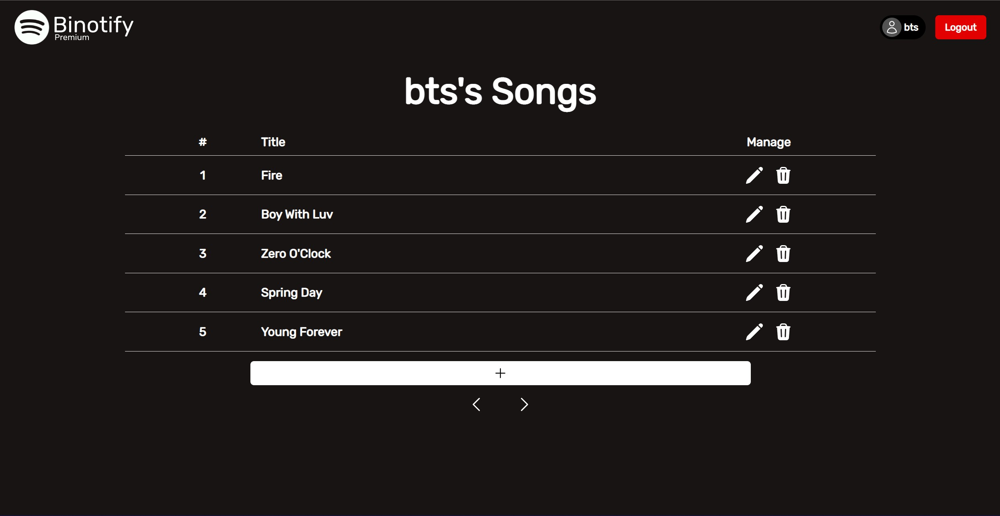

# TUGAS BESAR 2 IF3110 Pengembangan Aplikasi Berbasis Web
## _Milestone 2 -  Web Services using SOAP and REST_

### **Deskripsi**
**Binotify Premium** adalah sebuah aplikasi musik berbasis web pada BNMO yang dibuat untuk Indra dan Jak agar mereka dapat menjalankan bisnis barunya. Aplikasi ini dibuat dengan menggunakan React dan JavaScript menggunakan protokol SOAP dan dengan mengimplementasikan REST.

Program ini dibuat oleh :
- 13520077 / [Rava Naufal Attar](https://github.com/sivaren)
- 13520104 / [Yakobus Iryanto Prasethio](https://github.com/YakobusIP)
- 13520164 / [Hilda Carissa Widelia](https://github.com/hcarissa)

### **Screenshot Tampilan Aplikasi**
Berikut beberapa screenshot tampilan dari aplikasi

Login

Register

Manage Songs

### **Pembagian Tugas**

| Fitur | NIM 1 | NIM 2 | NIM 3 |
| :---: | :---: | :---: | :---: |
| Login | 13520164 | 13520104 |
| Register | 13520164 |  13520104 |
| Song Management | 13520104 |
| Subscription List | 13520077 |