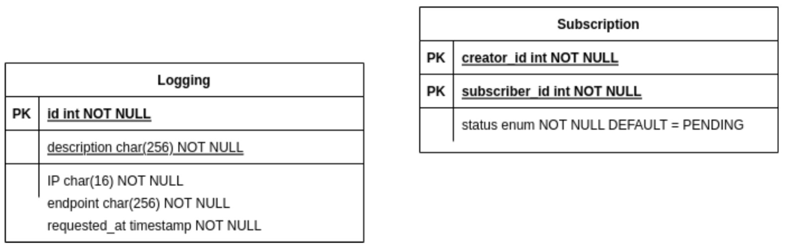

# TUGAS BESAR 2 IF3110 Pengembangan Aplikasi Berbasis Web
## _Milestone 2 -  Web Services using SOAP and REST_

### **Deskripsi**
**SOAP Service** digunakan untuk menangani pengajuan request subscription serta menerima approval dan rejection dari admin binotify premium. Dalam service ini, terdapat beberapa ketentuan yang diimplementasikan. Pertama terdapat security yaitu pembuatan logging pada database untuk semua request yang masuk di service SOAP, serta pembuatan API Key untuk kunci memanggil SOAP Service. Lalu tentu saja ada database yang terdiri dari dua tabel yaitu Logging dan Subscription, lalu penerimaan permintaan subscription dari Binotify App, penerimaan penolakan permintaan subscription, serta endpoint check status dari permintaan tersebut.

Program ini dibuat oleh :
- 13520077 / [Rava Naufal Attar](https://github.com/sivaren)
- 13520104 / [Yakobus Iryanto Prasethio](https://github.com/YakobusIP)
- 13520164 / [Hilda Carissa Widelia](https://github.com/hcarissa)

### **Skema basis data yang digunakan**
Berikut adalah skema basis data yang digunakan

### **Pembagian Tugas**
| Fitur | NIM 1 | 
| :---: | :---: | 
| Security | 13520077 | 
| Menerima Permintaan Subscription | 13520164 |
| Menerima Penerimaan / Penolakan Subscription | 13520077 |
| Endpoint Check Status Permintaan | 13520104 |